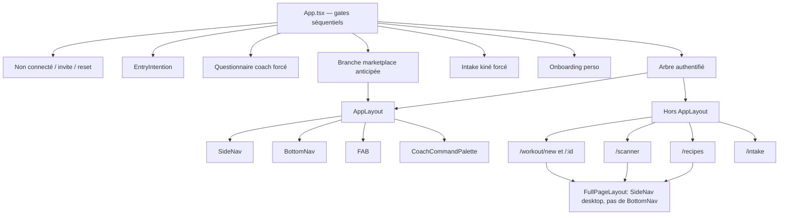

# Audit — Navigation, IA et structure front-end

> **Rôle de ce document** — diagnostic et architecture cible de la navigation Prometheus (mobile + desktop) et de la structure du frontend. Ce n’est pas un backlog. Les statuts et la file d’exécution restent dans [`CHANTIER.md`](CHANTIER.md). La destination produit reste [`VISION.md`](VISION.md). Les parcours cibles restent [`CARTE_PRODUIT.md`](CARTE_PRODUIT.md). L’inventaire des fonctionnalités par persona est dans [`RAPPORT_UX_FONCTIONNALITES.md`](RAPPORT_UX_FONCTIONNALITES.md). L’organisation des dossiers / `lib` / stores / tests est dans [`AUDIT_ARCHITECTURE.md`](AUDIT_ARCHITECTURE.md) (file Chantier **17–23**).
>
> **Preuve** : revue du code au 14 septembre 2026, puis alignement sur la refonte premium du PR 87 (`cursor/ux-premium-425e`). Pas de smoke authentifié dans cet environnement. Chaque constat cite un fichier.
>
> **PR 87 — ce qui est gardé.** NavLink, hub Progression (UX08), labels `text-xs` / `min-h-11`, FAB `safe-area`, primitives (`PageHeader`, `CardLink`, `EmptyState`, `TabList`), vérité nutrition/séance, first-run à un CTA, empty Coach Today. Le libellé d’accueil est **Dashboard** (plus « Aujourd’hui »).
>
> **Recalé 15 sept. 2026 — Accueil.** La cible n’est plus « une carte / un verbe ». L’accueil athlète est un **Dashboard** : priorité du jour **et** vue d’ensemble (rings nutrition, poids, check-in, coaching selon les modules). Si ce texte contredit `VISION.md` / `CHANTIER.md`, **ils gagnent**.
>
> **PR 87 — ce qui est corrigé ici.** Listes BottomNav/SideNav encore dupliquées → `navConfig`. Copilote en 5ᵉ onglet coach → Compte. SideNav 13 items plats + marketplace primaire → sections. Profil lisait le rôle, pas l’espace. SoloHub restait un tiroir alors que Progression existe. L’avatar sticky `CoachProfileButton` (palliatif PR 87) est retiré : Profil est le 5ᵉ onglet, y compris pour un coach sans outils personnels.

---

## Verdict

Prometheus a **l’âme de trois produits** et **le corps d’une seule PWA surchargée**.

Le moteur commun (un compte, trois situations, deux espaces) est la bonne décision. Le chrome actuel la trahit : il empile les destinations au lieu de faire sentir *dans quel produit on est*, *quelle est la prochaine action*, *où se trouve le reste*.

Un utilisateur ne doit jamais se demander : « Est-ce que le programme est dans Entraînement, dans Profil, ou seulement sur desktop ? »

Aujourd’hui, la réponse est : **ça dépend du rôle, de l’espace, de la largeur d’écran, et d’une copie locale de la liste d’onglets.**

---

## 1. Thèse — ce que ferait un produit radicalement simple

Cinq règles. Tout le reste en découle.

1. **Un chrome, une intention.** Mobile = cinq destinations quotidiennes, jamais plus. Desktop = les mêmes cinq, *groupées*, plus les outils rares. Pas une troisième carte mentale.
2. **L’accueil est un verbe.** L’écran Home n’est pas un tableau de bord de widgets. C’est « Reprendre la séance », « Traiter ce client », ou le vide honnête d’un jour sans tâche (VISION, UX07).
3. **Profil n’est pas un tiroir.** Compte, préférences, sécurité. Rien d’autre. Programme, stats, photos, recettes, annuaire n’ont rien à faire là (VISION solo complet + UX08).
4. **L’espace est un produit, pas un filtre.** Personnel et Coaching doivent *se voir* : mot, couleur, onglets, accueil. Même URL `/dashboard` pour deux applications = confusion garantie.
5. **Une source de vérité.** Destinations, libellés, ordre, badges : un seul module. BottomNav, SideNav, hubs Profil et animations d’onglets le consomment. Aujourd’hui ils divergent déjà.

La marketplace reste **un magasin qu’on entre**, pas un onglet permanent — exactement la phrase de la vision : accès discret et volontaire.

---

## 2. Cartographie actuelle

### 2.1 Personae et chrome

Quatre situations réelles, pas trois intitulés marketing.

| Situation | Comment le code la détecte | Chrome mobile (`BottomNav`) | Chrome desktop (`SideNav`) |
|---|---|---|---|
| Solo | `navPersona` → `solo` | Dashboard, Entraînement?, Progression, Nutrition?, Profil | Sections : Dashboard / S’entraîner / Corps / Comprendre / Compte + Activité en muted |
| Coaché | `navPersona` → `coached` | Dashboard, Entraînement?, Check-in?, Messages, Profil | Sections train/corps/messages/compte + Activité muted |
| Coach (espace Coaching) | `navPersona` → `coaching` | Dashboard, Clients, Messages, Programmes, Profil | Primary + Copilote + Activité muted + Compte |
| Dual-rôle | `capabilities.coach` et `personalToolsAvailable` | Switcher collé en haut + le jeu de l’espace actif | Switcher sous le logo + le jeu de l’espace |

Sources : `src/navigation/navConfig.ts`, `src/components/layout/BottomNav.tsx`, `SideNav.tsx`, `AppLayout.tsx`, `WorkspaceSwitcher.tsx`, `src/lib/accountContext.ts`.

### 2.2 Où vit vraiment chaque destination (solo)

| Destination | Mobile BottomNav | Desktop SideNav | Accueil | Profil / SoloHub | Ailleurs |
|---|---|---|---|---|---|
| Accueil `/dashboard` | oui | oui (libellé *Tableau de bord*) | — | — | — |
| Entraînement `/workout` | si tracking | si tracking (libellé *Entraînements*) | CTA séance | — | FAB |
| Nutrition | si tracking | si tracking | anneaux / cartes | — | FAB |
| Check-in | si tracking | si tracking | CTA secondaire | hub coaché | — |
| Profil | oui | oui | avatar | — | bouton coach mobile |
| Programme `/programs` | **non** | si tracking | carte gym / lien | **SoloHub** | `/routines` redirige ici |
| Stats / progression / calendrier | **non** | oui (sauf coaché) | liens bas de page | **SoloHub** | — |
| Poids | **non** | si tracking | carte | **SoloHub** | FAB |
| Photos | **non** | **toujours** | carte coaché | SoloHub / hub coaché | — |
| Recettes / scanner | **non** | **non** | — | recettes dans SoloHub | deep link nutrition |
| Annuaire / demandes | **non** | **oui, primaire** | — | SoloHub | branche routes marketplace |
| Messages | **non** (solo) | si coaché | carte coach | hub coaché | — |

C’est le cœur du problème IA : **mobile et desktop n’enseignent pas le même produit.** Sur téléphone, le solo *complet* promis par la vision est un tiroir nommé « Explorer » dans Profil.

### 2.3 Graphe des layouts



### 2.4 Inventaire des routes authentifiées

**Sous `AppLayout`** : `/dashboard`, `/workout`, `/nutrition`, `/weight`, `/calendar`, `/profile`, `/exercise-progress`, `/stats`, `/checkin`, `/clients`, `/clients/:id`, `/clients/:id/setup`, `/clients/:id/draft/:interventionId`, `/inbox/:interventionId`, `/messages`, `/messages/:clientId`, `/photos`, `/prometheus`, `/coach/questionnaire`, `/questionnaire`, `/coach/learned`, `/programs`, `/programs/new`, `/programs/:id`, `/routines`.

**Branche parallèle marketplace** (early return dans `App.tsx` avant intake/onboarding) : `/coaches`, `/coaches/compare`, `/coaches/:coachId`, `/coach/profile`, `/coaching-requests`.

**Hors `AppLayout`** : `/workout/new`, `/workout/:id`, `/scanner`, `/recipes`, `/intake`, `/invite/:token`, `/reset-password`.

**Catch-all** : `*` → `/dashboard`.

Gardes : `CoachOnly`, `CoachTrackerRedirect`, `CoachedAthleteRedirect`, `TrackingGate`, `ActiveRelationshipBoundary`, `HomeDashboard` / `MessagesHome` / `ProgramsHome` (le même path sert deux pages selon l’espace).

---

## 3. Ce qui est déjà juste — ne pas casser

- **Un moteur, deux espaces.** `resolveAccountContext` sépare capacité coach, relation personnelle et préférence d’affichage. L’espace n’accorde aucun droit. C’est la bonne colonne vertébrale (`accountContext.ts`, VISION).
- **Cinq onglets mobile, pas sept.** La discipline est là ; c’est le *contenu* des cinq et le débord qui pèchent.
- **TrackingGate.** Un module désactivé par le coach n’apparaît pas comme une fonctionnalité cassée : il disparaît. À condition que les libellés restants ne sautent pas (UX11).
- **Photos hors tab bar coaché.** Décision du 4 septembre, commentée dans `BottomNav.tsx` : le check-in est quotidien, les photos hebdo. Homme de goût.
- **Focus visible global et `prefers-reduced-motion`** dans `index.css`. Socle a11y déjà posé — le chrome ne s’en sert pas assez.
- **Command Center coach.** File du jour, pas un CRM de tuiles. La direction est bonne ; la densité de l’accueil et l’absence de compte dans la tab bar la sapent.

---

## 4. Diagnostic UX/UI — findings

Légende : **P0** = casse le modèle mental ; **P1** = friction quotidienne d’un parcours essentiel ; **P2** = qualité, a11y, dette qui fera dériver.

### P0 — Trois cartes mentales pour un seul utilisateur

**BottomNav, SideNav et SoloHub sont trois produits.**

Preuve de dérive déjà mesurable :

| Concept | Mobile | Desktop | i18n |
|---|---|---|---|
| Écran d’accueil perso | `nav.home` → Accueil | `nav.dashboard` → Tableau de bord | deux clés |
| Entraînement | `nav.workout` (singulier) | `nav.workouts` (pluriel) | deux clés |
| Accueil coach | `nav.today` | `nav.today` | OK |
| Programme solo | absent de la tab bar | dans la sidebar | SoloHub « Explorer » |
| Marketplace | SoloHub / hub coach mobile | items primaires | contradit VISION « discret » |

`PageTransition.tsx` mélange encore les index d’onglets coach et athlète dans **une** table (`/workout: 1` et `/clients: 1`). Les glissements d’onglets n’ont aucun sens spatial.

Jobs : *si deux écrans du même appareil n’enseignent pas la même carte, l’un des deux ment.*

**Cible** : un `navConfig` par `(workspace, personalCoaching)`. BottomNav, SideNav, hubs et transitions le lisent. Libellé unique par destination.

### P0 — Profil est devenu le système de fichiers

`SoloHub` (`src/components/profile/SoloHub.tsx`) existe *parce que* la tab bar a dit non à 9 destinations. Le commentaire le dit : surfaces « only in the desktop sidebar ». C’est un aveu d’échec d’IA, pas une feature.

Le hub coaché dans `ProfilePage.tsx` duplique encore Messages (déjà un onglet), Check-in (déjà un onglet), Programme, Photos, Nutrition, Poids, Intake.

UX08 est ouvert dans le Chantier. Le code n’a pas bougé : **trouver son programme sur mobile, c’est deviner Profil → Explorer.**

Jobs : Réglages n’a jamais contenu Mail. Mail n’a jamais contenu Réglages.

**Cible mobile solo (4+1)** :

| Onglet | Rôle | Contient |
|---|---|---|
| Accueil | priorité + vue d’ensemble | séance / programme du jour en priorité ; rings, poids, check-in, coaching selon les modules |
| Entraîner | faire | séances, programme, historique |
| Corps | logger | nutrition si active, sinon poids/photos selon tracking |
| Suivi | comprendre | stats, progression, calendrier |
| Toi | identité | compte, unités, langue, sécurité, **trouver un coach** en secondaire |

Cinq onglets. Le programme n’est plus caché. Profil n’explore plus.

**Cible mobile coaché** : Accueil · Séance · Check-in · Coach (messages) · Toi. Programme = carte primaire de l’accueil (déjà amorcé par `ClientGymCard`). Photos = carte hebdo sur l’accueil (déjà là). Nutrition/poids seulement si convenus, depuis Accueil ou Corps, jamais depuis un tiroir Profil.

**Cible mobile coach** : Aujourd’hui · Clients · Messages · Programmes · Toi. Prometheus n’est **pas** un onglet de tab bar : c’est un outil (palette + bouton dans Aujourd’hui). Un copilote n’est pas un lieu où l’on « habite ».

### P0 — L’espace Personnel d’un coach n’est pas un espace personnel

`ProfilePage` décide avec `coachingRole === 'coach'`, **pas** avec `activeWorkspace`.

Conséquences, code à l’appui (`ProfilePage.tsx`) :

- En espace **Personnel**, un dual-rôle voit encore le hub marketplace, les réglages coach, **et perd Objectifs / cibles** (`{!isCoach && GoalsForm}`).
- `SoloHub` est réservé à `!coached && !isCoach` : le coach qui s’entraîne n’a **aucun** accès mobile aux stats / calendrier / recettes via Profil, alors que la SideNav personnelle les affiche.
- Le toggle « Mode coach » (`enableCoachMode` / `disableCoachMode`) cohabite avec le `WorkspaceSwitcher` : deux métaphores pour changer de vie, l’une mute un rôle, l’autre une préférence d’affichage.

Jobs : *un interrupteur qui ne change pas la pièce, c’est un mensonge.*

**Cible** : tout le chrome — y compris Profil — lit `activeWorkspace`. Le toggle de capacité coach reste dans Compte, rare, explicite, jamais à côté du switcher d’espace.

### P1 — Coach mobile : pas de chemin évident vers le compte

BottomNav coach = 5 destinations métier, **zéro Profil**.

Palliatives actuelles :

- Desktop : lien pied de `SideNav`.
- Dual-rôle mobile : `CoachProfileButton` dans le sticky header, **uniquement** si `personalToolsAvailable` et pas déjà sur `/profile`.
- Coach *sans* outils personnels : ni switcher, ni avatar. Compte = … nulle part dans le chrome tactile.

Un professionnel qui veut changer de langue, se déconnecter ou éditer son offre marketplace doit improviser.

**Cible** : cinquième onglet = Toi (avatar). Marketplace (offre, demandes, annuaire) vit *dans* Toi ou dans un groupe desktop « Activité », jamais comme trois items égaux à Clients.

### P1 — Home n’a pas d’action principale, et le FAB est caché pile là

`AppLayout` masque le FAB sur `/dashboard`, `/coaches*`, profil marketplace, demandes — et dans tout l’espace Coaching.

L’accueil solo (`Dashboard.tsx`, ~780 lignes) empile ensuite : avatar, bannière de lien terminé, proposition de programme, carte gym, CTA check-in en `text-xs`, carte photos, lien intake en `text-xs`, CTA prochaine routine, encart calories, bouton questionnaire brut, revue hebdo, message coach, puis une ribambelle de cartes métriques (séances, poids, nutrition, eau, pas, streak, stats…).

C’est iTunes 11 : tout est visible, donc rien n’est important.

Le FAB, lui, flotte à `bottom-[76px]` sur les *autres* écrans et recouvre les derniers items de liste. Offset fixe, ignorant le home indicator au-delà de `safe-area-bottom` de la tab bar.

Jobs : *une action primaire. Les autres sont des satellites.*

**Cible** :

- Accueil : **une priorité** (reprendre / commencer / traiter) **plus** la vue d’ensemble du jour. Pas une carte exclusive qui cache nutrition / poids / check-in.
- FAB : soit une action contextuelle de l’écran (nutrition → ajouter un aliment), soit rien. Plus de menu radial global qui duplique la sidebar desktop.
- Espace Coaching : pas de FAB tracker. L’action primaire du jour est dans la file.

### P1 — Les séances immersives cassent le monde

`/workout/new`, `/workout/:id`, `/scanner`, `/recipes` sont **frères** de `AppLayout`, pas enfants. Ils enveloppent `FullPageLayout` : sidebar desktop, **pas de BottomNav**, pas de FAB.

Sur téléphone, disparaître la tab bar pendant une séance est juste (mode session, comme un appel). Encore faut-il :

- une sortie évidente (pas seulement un espoir de geste système) ;
- ne pas appliquer le même traitement à **Recettes**, qui n’est pas une session ;
- garder le contexte au retour (UX09) : onglet Nutrition, pas un teleport vers Accueil.

Aujourd’hui Recettes est une île. Scanner aussi. Le commentaire de `FullPageLayout` le documente comme un wrap « hors AppLayout » — c’est une exception devenue architecture.

### P1 — WorkspaceSwitcher jette le contexte

`choose()` persiste l’espace **et** `navigate('/dashboard')`. Toujours.

Passer de Coaching → Personnel au milieu d’une fiche client = perte de la fiche *et* de l’espace visuel, remplacés par un accueil athlète. L’inverse aussi.

De plus, `/dashboard` est un homonyme : `HomeDashboard` rend `CoachDashboard` ou `Dashboard`. L’URL ne dit pas le produit. Le bouton Retour du navigateur non plus.

**Cible** : préfixes d’espace (`/app/...` vs `/coach/...`) **ou** un `?space=` explicite n’est pas obligatoire si le chrome est indubitable (titre « Coaching », fond, onglets). En revanche, **ne pas** forcer `/dashboard` : rester sur une route compatible, sinon atterrir sur l’accueil *de l’espace cible* en le disant.

### P1 — Marketplace dans la nav primaire, et dans une branche de routes fantôme

VISION : marketplace discrète. SideNav perso et coach : **Annuaire** et **Demandes** au même niveau que Entraînement.

`App.tsx` sort `/coaches*` **avant** intake et onboarding. Deux arbres `AppLayout`. Une route n’a plus une seule définition. Risque : une personne en onboarding incomplet atteint l’annuaire avec un chrome d’app « finie ».

**Cible** : un seul `<Routes>` authentifié. Marketplace = section de Toi / Activité, ou entrée depuis l’intention `find_coach`, pas un onglet quotidien.

### P2 — Accessibilité du chrome

| Contrôle | État |
|---|---|
| Sémantique | `<nav>` oui ; items = `<button onClick={navigate}>`, pas `NavLink` |
| Onglet actif | couleur + scale + pastille ; **pas** `aria-current="page"` |
| Libellés tab bar | `text-[9px]` — sous le seuil de lecture confortable, zoom 200 % hostile |
| Badge messages | visuel seul, hors nom accessible |
| Cible tactile | `py-2` + icône 20 + label 9px : souvent sous 44×44 une fois le safe-area ignoré mentalement |
| Palette coach | ⌘K uniquement, zéro affordance à l’écran (sauf un bouton Search `hidden sm:inline-flex` sur l’accueil coach) |
| `Card onClick` | `<div>` cliquable (`Card.tsx`) — pas un bouton |

Le focus ring global existe. Les tab buttons n’ont pas de `focus-visible:ring` local, ils s’appuient sur le filet global — acceptable si on passe à de vrais liens.

### P2 — Densité desktop : 13 items plats

SideNav perso : dashboard, workouts, checkin, nutrition, messages?, programme, poids, photos, calendrier, stats, progression, annuaire, demandes, profil — plus trois « Ajout rapide ».

C’est un Finder sans dossiers. Aucune section (S’entraîner / Corps / Comprendre / Compte). Le scroll de sidebar (`overflow-y-auto scrollbar-hide`) cache la fin : Profil, justement.

Référence : Strong / Hevy gardent 5 tabs. Linear groupe Inbox / Issues / Views. Slack sépare workspaces et DM. Personne de sérieux n’aligne 13 verbes égaux.

### P2 — Micro-copy et homonymes

- `nav.prometheus` = le nom de **toute** l’app, collé sur un onglet copilote. L’utilisateur ne peut pas nommer l’outil (« Ask », « Copilote », « Assistant »).
- Check-in reste un anglicisme en FR.
- « Explorer » (SoloHub) = fourre-tout honteux.
- Accueil dit « Tableau de bord » sur desktop : jargon interne.

### P2 — Animations d’onglets mensongères

`PageTransition` : état **module-level** `previousTabIndex`. Une instance globale, index mélangés coach/athlète, première clé `startsWith` gagnante. Ce n’est pas de la direction spatiale, c’est du bruit.

---

## 5. Diagnostic — structure front-end

### 5.1 `App.tsx` est un système d’exploitation dans un fichier routes

~450 lignes : auth, reset, invite, profil, timezone, intake probe, questionnaire assignment, **huit** early returns, puis la carte des routes, plus six mini-composants de garde.

Conséquences UX directes : impossible de *voir* la carte ; la branche marketplace double l’arbre ; l’ordre des `if` *est* le produit.

**Cible** :

```text
src/
  app/
    gates/          entrée, invite, intake, onboarding (un fichier chacun)
    routes.tsx      un seul graphe authentifié
  navigation/
    navConfig.ts    source de vérité IA
    useAccountContext.ts
    AppShell.tsx    chrome unique, slots
    SessionShell.tsx  séance / scanner (mobile plein écran, desktop optionnel)
  pages/            écrans (ou garder components/<domaine>/*Page.tsx, mais plus de mélange)
  components/ui/    primitives y compris PageHeader, ListRow, EmptyState, NavItem
```

Pas besoin d’un rewrite. Besoin d’**une** carte et d’**un** shell.

### 5.2 Pas de primitive de page

`src/components/ui/` = Button, Input, Select, Card, Modal, Toast, ProgressRing, Sparkline, DateInput, AnimatedList, PageTransition.

**Absents** : PageHeader, BackLink, EmptyState, Tabs, NavItem, ListRow, Badge, SegmentedControl (le switcher d’espace est un one-off).

Chaque écran réinvente `px-4 pt-6 pb-28` + `h1 text-2xl` + chevrons. D’où les CTA check-in en `text-xs` à côté de cartes 56 px : pas de système, des accidents.

### 5.3 Écrans-dieux, store-dieu

| Fichier | Lignes | Problème pour la nav / l’UI |
|---|---:|---|
| `stores/coachingStore.ts` | ~2328 | Le chrome (unread, tracking, workspace, realtime) dépend d’un monolith |
| `stores/workoutStore.ts` | ~1137 | OK domaine, mais l’accueil l’importe avec 8 autres |
| `components/coaching/ClientDetailPage.tsx` | ~1095 | Mini-app ; UX09 (contexte au retour) y est critique |
| `components/dashboard/Dashboard.tsx` | ~780 | 9 stores, 15+ `navigate`, zéro hiérarchie visuelle forcée |
| `components/workout/ExerciseCard.tsx` | ~908 | Densité séance — hors nav mais tue le mode session |
| `lib/types.ts` | ~1048 | OK comme source de types ; la nav n’y a pas de modèle |

`useAccountContext()` existe **dans** `App.tsx` et n’est pas partagé. Layouts rappellent `resolveAccountContext(...)` à la main (5 copies).

### 5.4 Organisation par domaine : presque, pas tout à fait

Pas de `pages/`. Les écrans vivent sous `components/<domaine>/`, ce qui est tenable. Le vrai mélange :

- `Dashboard.tsx` orchestre nutrition + workout + poids + check-in + coaching + programmes.
- `ProfilePage.tsx` orchestre compte + IA overflow + marketplace + toggle de rôle.
- `layout/` connaît intimement le coaching store.
- `FullPageLayout` n’est pas un layout de routeur, c’est un wrap interne de 3 pages.

### 5.5 Couplage rôle vs espace

Deux vérités concurrentes :

| Fichier | Source de vérité |
|---|---|
| BottomNav, SideNav, AppLayout, WorkspaceSwitcher | `resolveAccountContext` → `activeWorkspace` |
| ProfilePage, Dashboard (en partie), CoachCommandPalette | `coachingRole === 'coach'` / `isCoachedAthlete` |
| TrackingGate | `isCoachedAthlete`, pas l’espace |

Un dual-rôle en Personnel est « coach » pour Profil et « athlète » pour la tab bar. L’UI se contredit.

---

## 6. Architecture cible — le chrome des trois produits

### 6.1 Un config, trois expériences

```ts
// Esquisse — pas une spec d’implémentation figée
type NavItem = {
  id: 'home' | 'train' | 'body' | 'progress' | 'you' | 'clients' | 'inbox' | 'programs';
  to: string;
  match: 'exact' | 'prefix';
  labelKey: string;
  icon: Icon;
  badge?: 'unreadMessages';
};

type NavSection = { id: string; labelKey?: string; items: NavItem[] };
```

- **Mobile** : `primary: NavItem[]` longueur 5.
- **Desktop** : `sections: NavSection[]` (les mêmes ids, groupés).
- **Overflow interdit** dans Profil. Si ça ne tient pas dans 5, l’information architecture est fausse, pas l’écran trop petit.

### 6.2 Desktop — grouper, pas allonger

```text
┌ Prometheus          [Personnel | Coaching]  ← switcher = changement de produit
│
│ AUJOURD’HUI
│   Accueil
│
│ S’ENTRAÎNER
│   Séances
│   Programme
│
│ CORPS                 (modules tracking)
│   Nutrition
│   Check-in
│   Poids
│   Photos
│
│ COMPRENDRE            (solo ; masqué si coaché)
│   Stats
│   Progression
│   Calendrier
│
│ ────────
│ Toi
│ Trouver un coach      ← muted, jamais bleu, jamais badge
└
```

Coach / Coaching :

```text
│ AUJOURD’HUI
│ CLIENTS
│ MESSAGES              badge
│ PROGRAMMES
│ ────────
│ Copilote              (pas le mot « Prometheus »)
│ ────────
│ Activité              offre, demandes, annuaire — replié par défaut
│ Toi
```

### 6.3 Mode session

Séance en cours = `SessionShell` :

- Mobile : plein écran, bouton Fermer/Terminer, pas de tab bar.
- Desktop : sidebar reste, contenu max-w lecture, ou split (consignes | saisie) plus tard.
- Recettes et listes : **restent dans AppShell**.

### 6.4 Accueil = une pile, pas un dashboard widget

Ordre immuable, chaque bloc a le droit de *ne pas s’afficher* :

1. Identité (prénom, date) — pas un bouton Profil concurrent de l’onglet Toi ; avatar décoratif ou retirable.
2. **Une** action primaire (UX07).
3. Un message / une alerte réellement non lus.
4. Un état d’attente vrai (programme en préparation, UX10) — jamais une fausse date.
5. Un résumé secondaire (semaine, calories) **après** le pli sur mobile.

Tout le reste a déjà un onglet. Le dupliquer sur Home est de la peur, pas de l’aide.

### 6.5 Routes : un arbre

Sortir les gates d’`App.tsx` sans changer le comportement. Supprimer la branche marketplace dupliquée. Déclarer les sessions comme routes layout `SessionShell`.

Homonymes à tuer à moyen terme : `/dashboard` coach vs perso. Deux paths (`/` perso déjà redirigé… viser `/today` vs `/home`, ou préfixe `/coach`). Ce n’est pas le premier commit ; c’est le premier *désir* d’URL honnête.

---

## 7. Plan d’exécution (architecture chrome)

**Ne pas exécuter depuis cet audit.** L’ordre, y compris les défauts qui mentent / verrouillent / détruisent un accès, est uniquement dans [`CHANTIER.md`](CHANTIER.md). La règle « UX après M0–M5 » est **abrogée**.

Les vagues ci-dessous restent une **spec chrome** (V0–V1 en grande partie dans `navConfig` ; reste lots 8 et 10 du Chantier). Ne pas en faire une file parallèle.

| Vague | Quoi | Pourquoi d’abord | Critère |
|---|---|---|---|
| **V0 — vérité** | `useAccountContext` partagé. Profil et palette lisent l’espace, pas seulement le rôle. Coach mobile : entrée Compte. | UX75 | Un coach en Personnel voit Objectifs ; un coach sans sticky header atteint `/profile` |
| **V1 — une carte** | `navConfig` + NavItem `NavLink` + `aria-current` + labels ≥11px. SideNav sectionnée. SoloHub allégé. | UX08, UX11, UX74, UX76 | Programme trouvable sans Profil ; libellés identiques mobile/desktop |
| **V2 — Home verbe** | Dashboard et CoachDashboard : une primaire. FAB contextuel. Recettes dans AppShell. | UX07 | Un test 5 secondes : « qu’est-ce que je fais maintenant ? » |
| **V3 — shells** | Extraire routes/gates. SessionShell. Plus de branche marketplace. Palette visible. | UX09, UX77 | Une définition par path ; séance immersive explicite |
| **V4 — URLs honnêtes** | Préfixe d’espace ou paths distincts. Switcher sans destroy. | Dual-rôle, Retour navigateur | L’URL + le chrome nomment le produit |

---

## 8. Ce qu’il ne faut pas faire

- Ajouter un sixième onglet « Plus ». Plus est un Profil déguisé.
- Personnaliser l’accueil avant d’avoir une nav par défaut (UX69 = P3, et c’est juste).
- « Aligner » mobile sur les 13 items desktop.
- Mettre Prometheus (le copilote) dans la tab bar comme une maison.
- Dupliquer un deuxième moteur de séances pour le rôle coach (VISION).
- Refactorer `coachingStore` *pour* la nav. Extraire les sélecteurs de chrome (unread, tracking, workspace) oui ; réécrire le store non.
- Changer les droits en changeant les onglets. L’espace n’accorde rien.

---

## 9. Correspondance Chantier

| Finding | ID existant ou ajouté |
|---|---|
| Home sans verbe, widgets empilés | UX07 |
| Programme / historique dans Profil | UX08 |
| Switcher → toujours `/dashboard` | UX09 |
| Libellés home/dashboard/workout(s), modules qui sautent | UX11 |
| Tab bar 9px, buttons vs links, badges | UX62 + **UX76** |
| Trois listes de nav, PageTransition hors-sol | **UX74** |
| Profil suit le rôle, pas l’espace ; coach mobile sans compte | **UX75** |
| App.tsx / branche marketplace / FullPageLayout | **UX77** |

---

## 10. Critères de fin de *cette* architecture (pas de ce document)

On saura que c’est réussi quand :

1. Un solo ouvre l’app sur téléphone et démarre une séance **sans** ouvrir Profil.
2. Un coaché nomme ses cinq onglets et ils correspondent à sa semaine réelle.
3. Un coach atteint langue / déconnexion / offre en un geste, sur 390 px de large.
4. Un dual-rôle bascule Personnel ↔ Coaching et peut dire, sans lire un tooltip, *dans quel produit* il est.
5. Un nouvel écran s’ajoute en **un** endroit (`navConfig` + une route), pas quatre.
6. Un lecteur d’écran annonce l’onglet actif. Un clavier le tab et l’active. Les labels restent lisibles à 200 % de zoom.

Jusque-là, Prometheus est un tracker intelligent dans un labyrinthe poli.
