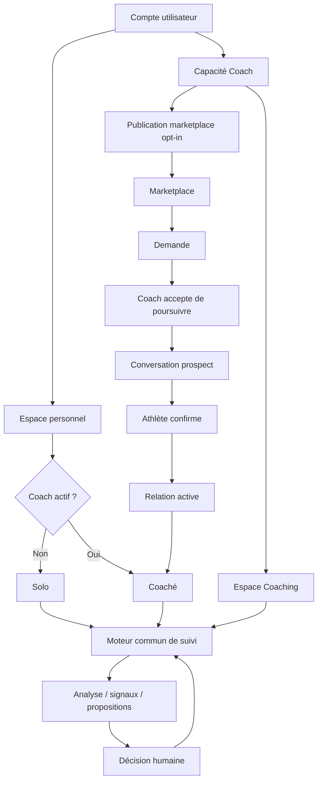
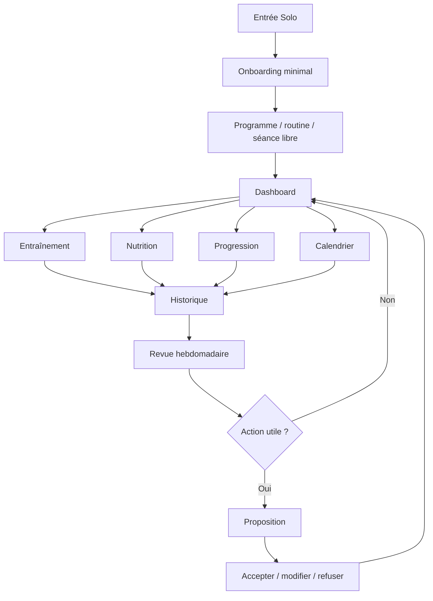
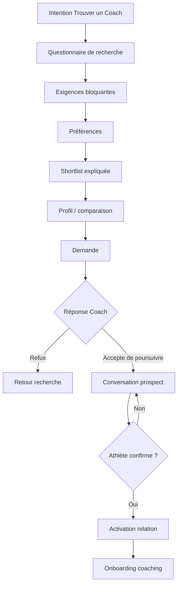
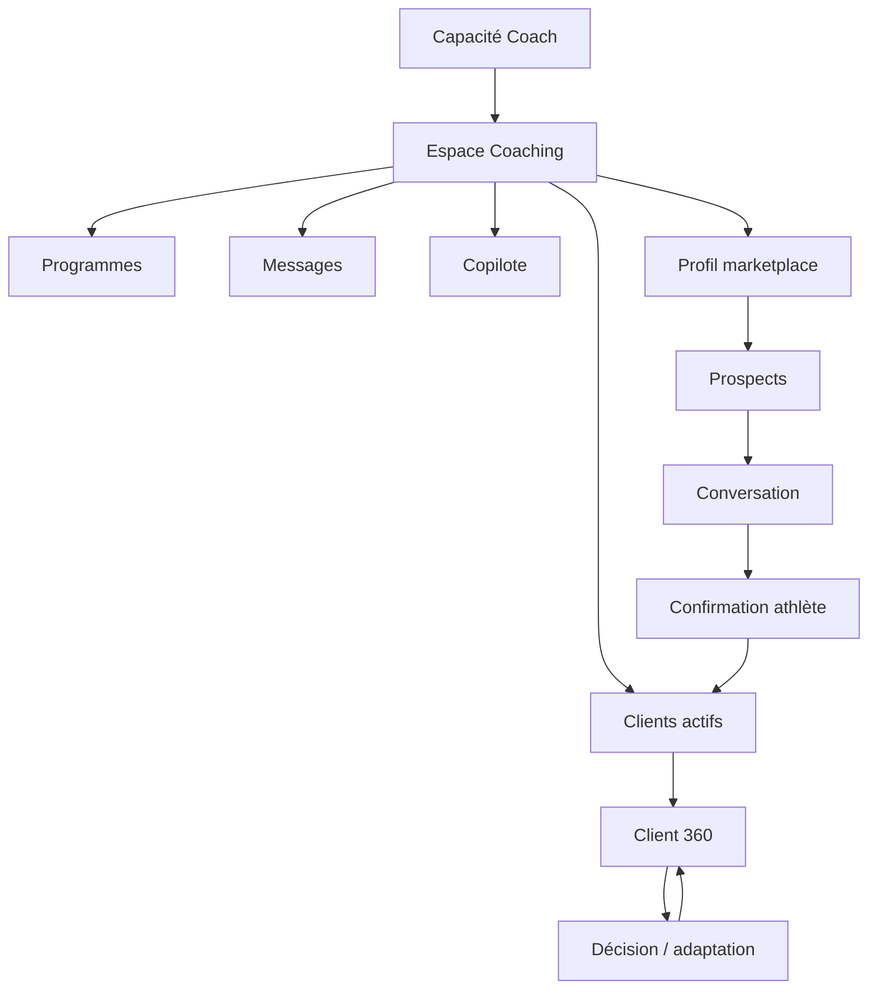
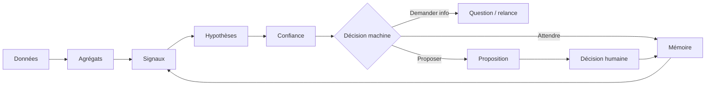

# Carte produit et architecture fonctionnelle cible — Prometheus

> **CONTRAT DES PARCOURS, DONNÉES ET PERMISSIONS**
>
> `VISION.md` dit **où va le produit**. `CHANTIER.md` dit **dans quel ordre y aller**. Ce document dit **comment les expériences doivent s’articuler**.
>
> Il ne prouve pas qu’une capacité est déjà livrée. Avant d’implémenter, inspecter le code actuel et les migrations les plus récentes.

**Référence : Vision du 17 septembre 2026.**

---

## 1. Carte conceptuelle



Prometheus ne doit jamais dupliquer son moteur de données par persona.

---

## 2. Entités conceptuelles principales

| Concept | Responsabilité | Ne doit pas faire |
|---|---|---|
| Compte | identité stable | coder une persona exclusive |
| Espace personnel | entraînement et données de l’utilisateur | dépendre du workspace Coaching |
| Relation Coach | définir l’état Coaché et les droits du Coach | donner la propriété des données au Coach |
| Capacité Coach | autoriser les fonctions pro | forcer la publication marketplace |
| Workspace | préférence UI Personal/Coaching | devenir une permission |
| Marketplace | découverte, matching, demandes | donner accès au dossier complet d’un prospect |
| Programme | plan, versions, phases, prescriptions | réécrire l’historique réalisé |
| Séance | exécution/logging | devenir un moteur distinct selon persona |
| Copilote | analyser et proposer | appliquer automatiquement |
| Entitlements | accès commercial | définir identité ou relation Coach |

---

## 3. Matrice des expériences

| Capacité | Solo | Coaché | Coach |
|---|---:|---:|---:|
| Lire son historique personnel | Oui | Oui | Oui dans espace personnel |
| Logger ses séances | Oui | Oui | Oui pour soi |
| Modifier son propre programme | Oui | Non sur plan piloté par Coach | Oui pour ses propres plans |
| Voir son calendrier | Oui | Oui | Oui personnel + outils clients dédiés |
| Nutrition personnelle | Oui | Oui si module disponible | Oui personnel |
| Voir données client | Non | Son propre dossier | Oui si relation active + scope |
| Gérer programmes clients | Non | Non | Oui |
| Recevoir propositions IA personnelles | Oui | Via Coach pour éléments coachés | Oui pour soi si Solo |
| Recevoir file IA clients | Non | Non | Oui |
| Publier profil marketplace | Non | Possible seulement si capacité Coach | Oui, opt-in |
| Accepter demande de prospect | Non | Non | Oui |
| Activer la relation finale | Athlète confirme | Athlète confirme | Ne peut pas activer seul |

---

## 4. Parcours d’entrée

### Nouveau compte

```text
Créer compte
→ choisir intention initiale
   ├── M’entraîner seul
   ├── Trouver un Coach
   └── Je suis Coach
→ onboarding minimal correspondant
→ première action utile
```

L’intention n’est pas un rôle irréversible.

### Utilisateur existant

Ne pas redemander l’intention à chaque connexion.

Le compte revient dans son contexte durable :

- relation Coach active ou non ;
- capacité Coach ;
- workspace préféré ;
- modules actifs.

---

## 5. Parcours Solo



### Contrat

Le Solo peut utiliser Prometheus sans IA et sans Coach.

La revue hebdomadaire existe mais peut conclure qu’aucune action n’est nécessaire.

---

## 6. Parcours recherche de Coach



### Données visibles au prospect

Avant activation, le Coach ne doit voir que ce qui est nécessaire et explicitement partagé :

- identité publique minimale ;
- objectif résumé ;
- préférences de recherche ;
- éléments volontairement ajoutés à la demande.

Pas d’accès complet aux séances, photos, check-ins ou historique sans relation active/consentement approprié.

---

## 7. Parcours Coaché

```text
Relation active
→ Dashboard personnel
→ programme assigné
→ séance / nutrition / check-in / messages
→ calendrier passé + futur
→ analyses Prometheus vers le Coach
→ Coach examine
→ Coach modifie / envoie / ignore
→ athlète voit les changements
→ objectif suivant ou fin de relation
```

### Fin de relation

```text
active
→ ended
→ permissions Coach retirées
→ attribution coachée archivée ou rendue inactive selon son propre contrat
→ données personnelles conservées
→ utilisateur Solo
```

Si l’utilisateur possède la capacité Coach, elle reste intacte.

**La relation de coaching elle-même n’a pas d’état `paused`.** Si l’accompagnement s’arrête, la relation passe à `ended`. Une reprise ultérieure suit un nouveau cycle relationnel. Le mot « pause » peut exister pour une attribution/programme, jamais pour masquer l’état réel de la relation.

---

## 8. Parcours Coach



Le Coach peut sortir du workspace Coaching et utiliser son espace personnel sans apparaître dans son propre roster.

---

## 9. Dashboard personnel

Le Dashboard répond à :

- priorité maintenant ;
- état de la journée.

Modules possibles :

- séance ;
- nutrition ;
- poids ;
- check-in ;
- coaching/messages ;
- progression ;
- actions rapides.

Règles :

- ne pas cacher tout le reste lorsqu’une séance est due ;
- ne pas afficher un module désactivé comme une tâche manquée ;
- limiter les cartes à ce qui aide réellement à agir.

---

## 10. Calendrier personnel

Le Calendrier est commun Solo + Coaché.

### Lecture

Doit progressivement regrouper :

- programme prévu ;
- séances réalisées ;
- nutrition ;
- poids/mensurations ;
- check-ins ;
- habitudes/événements pertinents.

### Écriture

L’athlète peut modifier ses propres données lorsque leur contrat le permet.

Un Coaché ne peut pas modifier directement le plan futur géré par son Coach.

La lecture du futur reste autorisée.

---

## 11. Programme et séance

### Modèle cible

```text
Program
├── metadata
├── phases/blocs
│   └── cycles éventuels
│       └── session templates
│           └── exercises
│               └── prescriptions
└── revisions
```

Le niveau de profondeur doit rester optionnel.

### Scheduling

Deux modes conceptuels :

- `calendar` ;
- `sequence`.

Ils aboutissent au même moteur de séance.

### Historique

Une séance réalisée stocke ce qui a réellement été exécuté. Une future révision ne la transforme pas rétroactivement.

---

## 12. Copilote

### Pipeline commun



### Autorité

Solo : décision humaine = athlète.

Coaché : décision humaine = Coach pour les adaptations de coaching.

### Mémoire

Une proposition refusée, modifiée ou différée devient du contexte pour les revues suivantes.

---

## 13. Matching marketplace

### Entrées

Athlète :

- objectif ;
- discipline ;
- niveau ;
- langue ;
- format ;
- localisation si présentiel ;
- budget lorsque applicable ;
- disponibilité ;
- contact souhaité ;
- autonomie ;
- style ;
- matériel ;
- contraintes.

Coach :

- disciplines ;
- langues ;
- formats ;
- zone ;
- offre ;
- disponibilité ;
- capacités déclarées ;
- qualifications ;
- limites commerciales futures.

### Sortie

```text
eligible
matched_requirements
matched_preferences
missing_information
explanation
```

Pas de score de compatibilité pseudo-scientifique par défaut.

---

## 14. Qualifications Coach

```text
CoachQualification
├── label/type
├── issuer
├── declared_at
├── proof
├── status
├── verified_at
└── expiration optionnelle
```

Affichage public : distinguer clairement « déclaré » et « vérifié par Prometheus ».

Pas d’étoiles/avis publics dans la cible actuelle.

---

## 15. Messagerie

Une relation logique Coach–athlète possède un fil principal.

### Prospect

La conversation peut commencer après acceptation du Coach sans créer de relation active.

### Client actif

Le fil continue et peut contenir des références structurées :

- workout ;
- exercise/set ;
- check-in ;
- program revision ;
- proposal.

Une référence structurée ouvre la source de vérité, elle ne duplique pas toutes les données dans le message.

---

## 16. Objectifs

```text
Goal
├── type
├── description
├── status
├── started_at
├── ended_at
├── transition_reason
└── successor_goal_id
```

Statuts : active, reached, maintenance, replaced, paused, abandoned.

Les analyses utilisent l’objectif valable à la période observée.

---

## 17. Import Coach

### Client existant Prometheus

```text
upload
→ parse
→ map
→ preview
→ correction
→ confirm
→ write
```

### Client sans compte

```text
Coach prépare import provisoire
→ invitation
→ compte utilisateur
→ preview de rattachement
→ consentement
→ transfert vers propriétaire réel
```

Un import doit être idempotent ou disposer d’une clé de reprise claire.

L’import est une priorité d’adoption. Un export complet de toutes les données n’est pas une fonctionnalité produit prévue actuellement ; une éventuelle portabilité légale reste un sujet distinct.

---

## 18. Commercial

Les entitlements n’accordent pas directement les rôles métier.

Concepts :

```text
Solo entitlement
Coach entitlement
Coach tier/client limit
trial/grace
beta bypass
billing status
```

Décisions :

- Solo trial : 14 jours ;
- Coach grace : 7 jours ;
- prix non décidés ;
- bêta mesurée même si accès offert ;
- Prometheus facture le logiciel, pas la prestation de coaching ;
- le paiement Coach ↔ athlète reste hors Prometheus dans la Vision actuelle ;
- un Coaché ne paie pas directement Prometheus pendant une relation active.

---

## 19. Architecture de permissions

Éviter :

```text
if persona === coached => deny page
```

Préférer :

```text
canRead(resource, actor)
canCreate(resource, actor)
canUpdate(resource, actor)
canManagePlan(actor, relationship)
```

Les noms exacts de fonctions peuvent varier. Le principe ne varie pas.
Les décisions actuelles sont dans `src/features/account/domain/resourcePermissions.ts`.

### Exemples

Coaché :

- lire son calendrier : oui ;
- logger sa séance : oui ;
- lire programme assigné : oui ;
- modifier programme assigné : non ;
- envoyer une demande de changement : oui.

Coach lui-même coaché :

- gérer ses clients : oui dans workspace pro ;
- consulter son propre programme assigné : oui dans espace personnel ;
- modifier ce plan comme Coach de lui-même : non.

---

## 20. Frontières techniques recommandées

Le produit reste un monolithe modulaire React + Supabase.

```text
src/
├── app/        routing, guards, bootstrap, navigation
├── features/
│   ├── account/
│   ├── coaching/
│   ├── marketplace/
│   ├── workout/
│   ├── programs/
│   ├── nutrition/
│   ├── checkin/
│   ├── goals/
│   └── imports/
└── shared/     primitives réellement transversales
```

Flux cible :

```text
screen/component
→ hook/use-case/model
→ domain API
→ Supabase/RPC
```

Une règle critique va en DB/RPC/RLS lorsqu’elle doit résister à un client modifié.

---

## 21. Questions obligatoires avant nouvelle fonctionnalité

Toute proposition doit répondre :

- quelle persona voit la capacité ?
- qui possède les données ?
- quelle action est autorisée ?
- quelle source de vérité ?
- quel état transitoire ?
- quelles conséquences à la fin d’une relation ?
- comportement réseau/offline ?
- réutilisation d’une primitive existante ?
- test de sécurité ?
- test UX ?

Si l’agent ne peut pas répondre, il doit d’abord inspecter le domaine au lieu de créer du code spéculatif.
