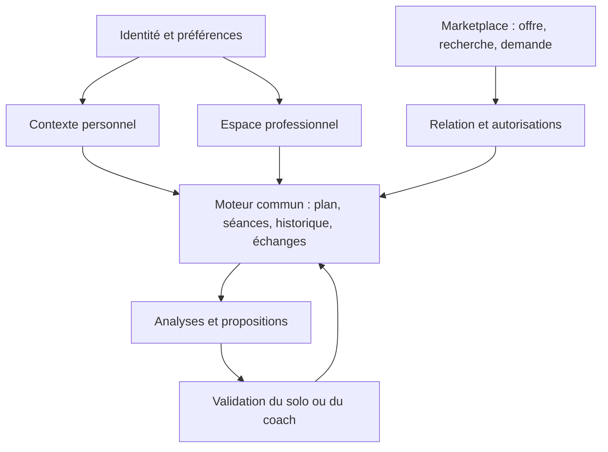
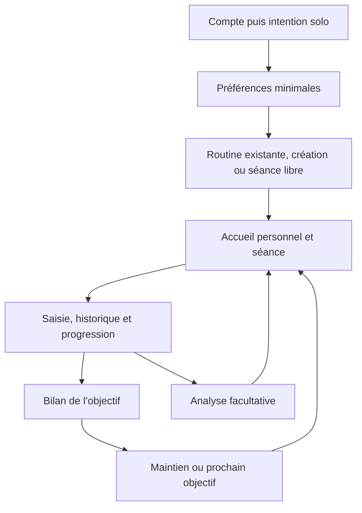
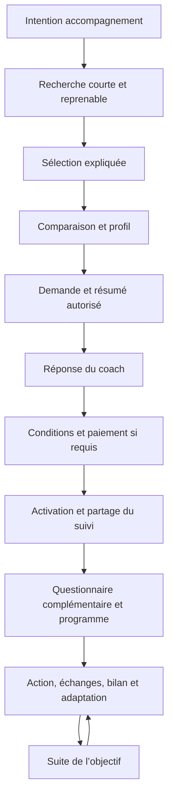
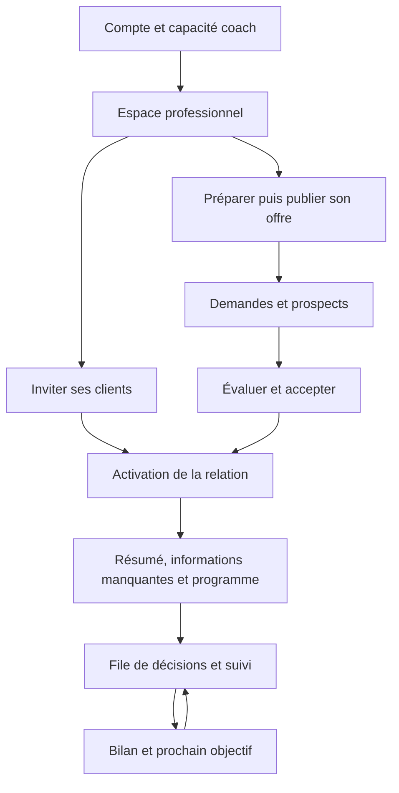

# Carte produit et architecture cible — Prometheus

> **RÔLE — CONTRAT DES PARCOURS ET PLAN DE TRANSITION**
>
> Ce document compare une revue du code à la destination produit, décrit les écrans et permissions cibles et explique comment faire évoluer l’existant. Il ne prouve pas qu’un écran ou une migration est livré.
>
> **Instruction pour les agents :** lire la Vision pour les principes et le Chantier pour les statuts et priorités. Ici, conserver les contrats de parcours et leurs dépendances ; ne pas créer un deuxième backlog ni supprimer une fonctionnalité existante pour obtenir une architecture plus élégante. Mettre à jour les constats lorsque leurs sources changent.

**Référence : vision du 12 septembre 2026, Accueil précisé le 15 septembre (Dashboard = priorité + vue d’ensemble).** Les constats du tableau §1 qui décrivent encore l’entrée « rôle avant login », le départ client absent ou la marketplace absente sont **périmés** : voir `CHANTIER.md` (M2–M5, M3, UX07). Cette carte garde les contrats de parcours ; elle n’ordonne pas le travail.

## 1. Conclusion de la revue

Prometheus possède déjà son moteur de suivi et une plateforme coach. La destination reste la couche qui relie identité, intention, découverte d’un coach, engagement et suivi. L’**ordre d’exécution** (y compris les défauts qui mentent, verrouillent ou détruisent un accès) est uniquement dans `CHANTIER.md` : ne pas reconstruire les lots M dont le code existe, et ne pas reporter un bilan de séance faux derrière M8.

Les données personnelles restent attachées à l’utilisateur. Solo et coaché décrivent sa situation d’accompagnement ; coach décrit une capacité professionnelle. L’espace affiché ne décide jamais des droits.

### Périmètre et preuves

Sources relues sur `new-JV` le 12–13 septembre 2026, recalées le 15 septembre. Le statut des lots **M0–M5 Terminé** est uniquement dans `CHANTIER.md` (ne pas reconstruire). Cette carte ne prouve aucun déploiement.

La lecture n’est pas un audit exhaustif de toutes les policies ni une preuve de production. Les absences ci-dessous signifient « non raccordé au parcours dans les sources inspectées », à confirmer par inventaire complet avant création d’une table ou d’un service. Les extraits historiques SQL doivent être confrontés à toutes les redéfinitions ultérieures lors de l’implémentation.

| Domaine | Constat vérifiable | Réutilisation / écart |
|---|---|---|
| Identité | [authStore](../src/stores/authStore.ts) utilise email/mot de passe, récupération et session | Réutiliser Auth. Google/Apple ne sont pas exposés par ce store ; configuration et parcours complets restent à vérifier/construire. |
| Entrée | Login email+mdp ; intention après identité (`EntryIntentionPage`). Habitué solo/coaché ne revoit pas le picker (M3) | Conserver. OAuth plus tard. |
| Rôles | [types](../src/lib/types.ts) expose `coaching_role = none/coach/client` ; [coachRole](../src/lib/coachRole.ts) exclut le coach du solo | État exclusif incompatible avec coach + entraînement personnel. Introduire une projection de capacités progressivement. |
| Routage | [App](../src/App.tsx) contient `CoachTrackerRedirect`, `CoachOnly`, `CoachedAthleteRedirect` | Plusieurs routes personnelles sont interdites au coach ; stats et calendrier sont aussi bloqués pour le coaché. Ouvrir selon propriété et type d’action, sans ouvrir l’édition du plan coach. |
| Onboarding | App possède plusieurs portes globales de questionnaire, dont questionnaire coach incomplet | Réutiliser les composants ; séparer configuration minimale, recherche et prise en charge. Ne pas bloquer messages/historique par un questionnaire global. |
| Moteur séances | `Workout.user_id`, `Routine.user_id` ; [startWorkout](../src/lib/startWorkout.ts) appelle une RPC commune avec routine ou programme assigné | Conserver les identifiants et cette entrée commune. Aucun deuxième moteur coaché. Import externe non prouvé par cette lecture. |
| Programmes | [programStore](../src/stores/programStore.ts) expose création atomique, fork, révisions et attributions en pause | Réutiliser. Distinguer routine, modèle propriétaire et attribution ; ne pas les fusionner par simple renommage. |
| Erreurs programmes | `fetchPrograms` remplace la liste par vide en cas d’échec ; `fetchProgram` renvoie null pour plusieurs causes | Rendre les résultats typés : vide, inaccessible, absent et erreur réseau doivent mener à des issues différentes. |
| Accueil personnel | [Dashboard](../src/components/dashboard/Dashboard.tsx) : priorité + « Ta journée » (programme, rings nutrition, poids, semaine, check-in, coaching selon modules) | Conserver ce contrat. Ne pas revenir à « une carte exclusive ». Programme joignable depuis l’accueil (UX08). |
| Console coach | [CoachDashboard](../src/components/coaching/CoachDashboard.tsx) réutilise priorités, file du jour, bilans, invitations et erreurs partielles | Préserver le centre de décisions ; ajouter les prospects dans une zone distincte du suivi des clients. |
| Invitations | [coachingStore](../src/stores/coachingStore.ts) appelle `accept_coach_invite`, aperçu et rafraîchissement | Conserver l’entrée des clients existants. Lier les futures demandes au même invariant d’association côté serveur. |
| Questionnaires | [coachQuestionnaireApi](../src/lib/coachQuestionnaireApi.ts), [migration questionnaire](../supabase/migrations/20260911235551_coach_questionnaires.sql) : versions et réponses avec révision | Réutiliser rendu/validation et historique. Le questionnaire de recherche a un contrat séparé ; pas de réécriture des anciennes réponses. |
| IA personnelle | [migration self-coach](../supabase/migrations/20260906023512_solo_self_coach.sql) utilise une intervention sur soi ; son prédicat historique exige `none` | Auditer les redéfinitions SQL et les Edge Functions avant d’autoriser le coach dans son espace personnel. Aucun auto-lien de coaching. |
| Départ | Client : `client_end_coach_link` + modal (M2a). Coach : `end_coach_client_link` | Conserver. Pas de voie parallèle. |
| Hors ligne | [offlineQueue](../src/lib/offlineQueue.ts) porte compte, identifiants stables, mapping et dead-letter ; [sessionScope](../src/lib/sessionScope.ts) fournit isolation et générations | Réutiliser pour les séances. Ne pas promettre une marketplace ou des paiements utilisables hors ligne. |
| Marketplace | Offre opt-in, annuaire, demandes, acceptation = lien actif (M4–M5). Billing fermé (M6) | Matching guidé, capacité réelle, modération et encaissement restent distincts. |
| Objectifs | Profil avec objectif ; pas de cycle objectif atteint/maintien/successeur dans les contrats inspectés | Ajouter un cycle de vie sans changer rétroactivement le sens des anciennes données. |
| Historique technique | Lock et production : 99 versions, dernière `20260911235551_coach_questionnaires` | Git, lock et `schema_migrations` doivent rester alignés. Ne jamais prendre un résumé daté pour un inventaire live. |

## 2. Architecture fonctionnelle cible

Conserver React, les stores et PostgreSQL dans un ensemble modulaire. Aucun besoin démontré de microservices ni d’un second stockage de performances.

| Module | Responsabilité | À ne pas lui confier |
|---|---|---|
| Identité / capacités | Compte, capacité professionnelle, contexte d’affichage, étapes initiales | Ne pas dériver les droits d’une préférence ou de metadata modifiable. |
| Données personnelles | Saisies, historique et objectifs liés à user_id | Aucun transfert de propriété vers un coach. |
| Programmes | Modèles, attributions, snapshots et révisions | Pas de duplication du moteur de séance ; pas d’édition des anciennes réalisations. |
| Relation | Association unique, accord de partage, fin et événements de relation | Pas de paiement implicite ni d’autorisation donnée à tous les prospects. |
| Marketplace | Profils publiés, offres, disponibilité, recherche et demandes | Pas d’accès direct au dossier sportif complet. |
| Communication | Conversations avec participants explicites, reprise et notifications | Une notification ne remplace pas une écriture transactionnelle. |
| Commercial | Conditions acceptées, paiement et accès au service | Ni décision de rôle via écran de checkout ni changement de droits sur simple URL retour. |
| Copilote | Synthèses et propositions contextualisées | Ni auto-application, ni diagnostic, ni classement opaque. |

Les frontières proposées sont d’abord des contrats de fonctions et des responsabilités dans le dépôt existant. Extraire un module uniquement pour un changement utile, pas découper tous les stores dans une refonte.

## 3. Identité, capacités, contexte et propriété

### Modèle proposé

- **Identité** : un `auth.users.id`, stable.
- **Capacité personnelle** : tout compte peut utiliser ses données personnelles.
- **Capacité professionnelle** : état serveur autorisant les outils coach ; indépendant d’un lien reçu comme athlète.
- **Contexte d’interface** : Personnel / Coaching. Préférence d’affichage, sans pouvoir d’autorisation.
- **Accompagnement personnel** : solo si aucun lien actif ; coaché si lien actif.
- **Publication marketplace** : opt-in séparé de la capacité coach et de l’usage des invitations.
- **Entitlement commercial** : séparé de tous les éléments précédents.

Un coach peut ainsi s’entraîner personnellement sans devenir son propre client. Le modèle peut représenter un coach lui-même accompagné ; le parcours de cette combinaison doit être testé avant activation, sans le confondre avec le suivi de ses clients.

### Matrice cible

| Action | Personnel sans coach | Personnel coaché | Professionnel |
|---|---|---|---|
| Lire son historique | Oui | Oui | Oui dans son contexte personnel |
| Saisir ses réalisations | Oui | Oui | Oui pour soi ; pas se faire passer pour un client |
| Éditer un programme | Ses propres documents | Ne modifie pas le plan piloté par le coach ; peut lui demander un changement | Ses modèles et les attributions qu’il est autorisé à gérer |
| Valider une proposition personnelle | Oui | Pas sur les éléments pilotés par le coach | Oui pour soi sans coach ; pour ses clients dans le contexte professionnel |
| Consulter un prospect | Sa propre demande | Sa propre demande | Seulement les demandes adressées au coach et le résumé consenti |
| Lire le dossier d’un client | Non | Son propre dossier | Lien actif + périmètre de partage applicable |
| Publier un profil coach | Non sans capacité | Possible si capacité accordée | Oui après validation des champs et choix de publication |
| Fin du coaching | Sans objet | Oui, pour son lien | Oui, pour l’un de ses liens, sans toucher sa capacité professionnelle |

Les autorisations de lecture et d’écriture sont différentes. Désactiver un module ne doit pas effacer son historique ; sa consultation personnelle doit rester possible. Le détail des modules de suivi convenus doit rester intelligible.

### Propriété et accès

Les saisies et objectifs personnels suivent le compte. Un modèle créé par le coach conserve son propriétaire ; une attribution et son snapshot peuvent être archivés pour le client selon les règles existantes. Donner accès à son histoire ne transfère ni les notes privées de Coach A, ni sa bibliothèque, ni sa conversation privée avec le client à Coach B.

Un résumé est une donnée dérivée, avec sources, date et périmètre d’accès. Sa version doit être invalidée à la révocation du partage ; aucune synthèse ne permet de contourner une permission retirée.

## 4. Parcours complets

### Solo

L’import est une option cible dont formats et validation restent à définir ; il ne bloque pas la séance libre. Aucune recherche de coach ni génération IA n’est imposée. Une période sans entraînement n’est pas un échec à corriger automatiquement.

### Client en recherche puis coaché

Chercher un coach ne rend pas immédiatement coaché. Pendant recherche, demande et paiement en attente, le compte garde son espace personnel. Afficher trois à cinq recommandations si l’offre compatible le permet ; afficher moins si nécessaire. Ne jamais combler avec un coach incompatible.

### Coach

La publication marketplace n’est pas obligatoire pour utiliser les outils coach. « Mon entraînement » ouvre les outils communs avec l’utilisateur comme sujet, sans le montrer dans sa propre liste clients.

## 5. Contrat commun des écrans

Les identifiants ci-dessous décrivent des écrans logiques ; une section ou un tiroir peut suffire. Ne pas créer mécaniquement une page par ligne.

Sur tous les écrans : langue FR/EN, focus/clavier et mobile utilisables ; chargement distinct du vide ; erreur avec reprise ciblée ; identité contrôlée après chaque requête asynchrone. Conserver filtres, position et brouillons au retour. Seules les opérations prises en charge par une file durable sont annoncées comme sauvegardées hors ligne.

**Permissions abrégées** : U = utilisateur sur ses données ; C = capacité coach ; R = relation active et partage ; P = parties de la demande ; S = opération serveur. Chaque ligne hérite de ces règles, y compris ses états d’erreur.

### Entrée et compte

| ID / écran | Objectif et informations | CTA principal → état suivant | Secondaires | Vide / erreur | Permissions |
|---|---|---|---|---|---|
| E01 Découverte | Expliquer autonomie, accompagnement et activité coach | Créer un compte → E02 | Connexion ; comprendre le service | Pas de profils inventés si catalogue vide ; accès à l’auth conservé | Public pour présentation ; annuaire authentifié dans le premier périmètre |
| E02 Auth | Email, Google/Apple une fois configurés ; contexte invitation conservé | Continuer → vérification puis E03 ou destination connue | Se connecter ; récupération ; changer de méthode | Email à confirmer, OAuth annulé, compte existant : reprise sans doublon | Visiteur ; identité validée par Auth |
| E03 Intention | Trois choix et une phrase utile par choix | Continuer → S01 / M01 / C01 | Revenir ; reprendre une invitation | Échec de sauvegarde : choix conservé ; pas de boucle au login suivant | U ; aucune capacité privilégiée accordée par le seul choix local |
| E04 Compte / espaces | Identité, langue, unités, Personnel/Coaching si disponible | Ouvrir l’espace choisi → accueil | Partage ; sécurité ; sortie du compte | Capacité indisponible : expliquer et garder Personnel ; erreur ne réinitialise pas le compte | U, droits serveur pour Coaching |
| E05 Invitation | Nom du coach, compte destinataire, contenu et effets du lien | Accepter → activation ou complément | Changer de compte ; refuser | Expirée/utilisée/invalide ; lien actif ailleurs : transition explicite, pas remplacement silencieux | U + validation atomique S du token |

### Espace personnel et suivi

| ID / écran | Objectif et informations | CTA principal → état suivant | Secondaires | Vide / erreur | Permissions |
|---|---|---|---|---|---|
| S01 Préférences minimales | Langue, unités, préférences nécessaires à la première action | Continuer → S02 | Plus tard pour le facultatif | Valeur invalide près du champ ; reprise des valeurs | U |
| S02 Démarrer | Routines existantes, création et séance libre ; import si format supporté | Choisir la prochaine action → S03 ou S04 | Créer routine ; import explicite | Sans routine : séance libre ; import invalide ne crée aucun contenu partiel | U |
| S03 Home solo | Séance reprenable/prévue, activité récente et évolution choisie | Reprendre / Commencer → S04 | Historique ; programme ; aide IA ; trouver un coach discret | Jour sans séance : aucune obligation inventée ; données périmées signalées | U |
| S04 Séance partagée | Exercices, consignes, réalisations, état sauvegarde | Terminer → S05 | Reprendre, corriger, pause ; quitter avec brouillon | Réseau perdu : file existante ; quota/échec durable visibles ; partiel reste partiel | U sur réalisations ; lecture du plan autorisé |
| S05 Historique / détail | Séances datées et provenance du plan | Consulter une séance → détail | Filtrer ; corriger ses saisies ; revenir | Pas encore de séance : démarrer ; erreur n’affiche pas un historique vide | U ; R en consultation coach autorisée |
| S06 Progression / objectif | Tendances fondées sur données, période et objectif choisi | Examiner le bilan → S08 | Changer période ; détail ; analyse facultative | Données insuffisantes explicitement ; absence de conclusion automatique | U ; R selon partage |
| S07 Programme / routines | Plan actif, documents personnels et archives en pause | Démarrer un jour ou éditer un document autorisé | Dupliquer/adopter si permis ; consulter révisions | Aucun plan : séance libre pour solo ; en préparation pour coaché ; conflit de version récupérable | U propriétaire ; coaché en lecture du plan assigné ; C+R pour adaptation |
| S08 Bilan / suite | Résultat observé, objectif choisi, contexte et date | Choisir maintien ou nouvel objectif → S03/H01 | Continuer le même objectif ; changer de mode | Pas de données suffisantes : bilan déclaré distingué de mesure ; brouillon conservé | U ; décision partagée avec coach pour son plan |
| S09 Aide IA facultative | Question, faits sourcés, période, proposition et limites | Examiner puis accepter si autorisé → document concerné | Modifier ; ignorer ; fermer | Analyse indisponible : tracker utilisable ; aucune fausse conclusion | U sans coach sur plan personnel ; coaché peut demander à son coach |
| S10 Outils complémentaires | Recettes, préférences et autres modules existants utiles dans le contexte | Ouvrir l’outil choisi → saisie/consultation | Historique ; réglages | Module facultatif non configuré : choix explicite ; échec ne bloque pas la séance | U ; R seulement pour le périmètre convenu |

### Marketplace et conversion

| ID / écran | Objectif et informations | CTA principal → état suivant | Secondaires | Vide / erreur | Permissions |
|---|---|---|---|---|---|
| M01 Recherche guidée | Critères qui changent la compatibilité ; réponses existantes confirmables | Voir les coachs → M02 | Retour ; sauvegarder ; explorer l’annuaire | Reprise du brouillon ; erreur réseau sans perte ; pas de dossier détaillé requis | U uniquement |
| M02 Résultats | Petite sélection, raisons, inconnues, disponibilité et filtres | Voir un coach → M04 | Modifier critères ; M03 ; explorer plus | Aucun résultat : ajuster volontairement ou solo ; jamais élargir une exigence en secret | U ; profils publiés seulement |
| M03 Comparaison | Même structure : service, méthode, suivi, langue, disponibilité, prix applicable | Voir le profil choisi → M04 | Retirer un profil ; revenir aux résultats | Profil retiré : indiquer indisponible ; conserver les autres choix | U ; champs publics limités |
| M04 Profil coach | Peut-il m’aider, méthode, confiance, offre et conditions | Demander → M05 | Retour ; comparer ; signaler | Indisponible : pas d’envoi ; statut changé revalidé côté serveur | Authentifié ; aucun dossier du visiteur transmis |
| M05 Confirmer demande | Offre choisie, résumé qui sera transmis, objectif et message facultatif | Envoyer → M06 | Corriger le résumé ; annuler | Double clic/réessai : même demande ; capacité atteinte : retour au choix | U ; S vérifie coach, offre, état et limites |
| M06 Mes demandes | État réel, coach, date, prochaine action | Ouvrir réponse → M07 si acceptée | Retirer ; changer critères ; continuer solo | Aucune demande : M01 ; réponse indisponible : réessayer sans renvoyer | P ; transitions contrôlées S |
| M07 Accord / paiement | Offre figée, conditions, statut accepté, montant si applicable | Confirmer/payer → M08 | Retour ; abandon explicite ; aide | Échec : reprise ; attente webhook : attendre/vérifier, pas repayer automatiquement | P ; état financier S |
| M08 Démarrer ensemble | Relation activée, périmètre de partage et ce qui manque | Compléter l’accueil → H02/H01 | Revoir partage ; contacter coach | Paiement confirmé mais activation en attente : état récupérable et support ; aucune activation locale fictive | U ; R après activation ; S pour transaction |
| M09 Partage | Catégories, période, destinataire, portée actuelle et révocation | Confirmer → contexte d’origine | Réduire ; retirer l’autorisation | Refus respecte le choix et indique l’effet sur le suivi ; sauvegarde échouée garde l’ancien accord | U ; coach lecture du périmètre effectif |

### Client coaché

| ID / écran | Objectif et informations | CTA principal → état suivant | Secondaires | Vide / erreur | Permissions |
|---|---|---|---|---|---|
| H01 Home coaché | Priorité du jour + vue d’ensemble (séance, rings, poids, check-in, messages, programme) | Action de la priorité → S04 / Messages / Check-in | Programme ; progression lecture | Plan en préparation : empty honnête + Messages ; aucune heure fictive | U, R pour contenu coach |
| H02 Questionnaire complémentaire | Champs manquants, réponses réutilisées avec source/date | Envoyer → H01 | Corriger ; reprendre plus tard ; messages | Version changée/conflit : conserver brouillon et résoudre ; ne pas redemander le dossier entier | U sur réponse ; R sur lecture partagée |
| H03 Messages | Fil, destinataire et états réellement prouvés | Envoyer → même fil | Réessayer ; charger historique ; ouvrir contexte | Fil vide : composer ; réseau lent : conserver le message suivant ; aucun faux « lu » | Participants autorisés ; anciens fils selon règles d’archive |
| H04 Bilan de suivi | Questions choisies et informations utiles au coach | Envoyer → reçu, en attente de revue | Brouillon ; corriger selon règles | Pas de bilan demandé : aucune obligation ; échec garde les réponses | U ; C+R pour revue |
| H05 Relation / départ | Coach actif et effets sur accès, programme et paiement distinct | Confirmer départ → H06 | Annuler ; contacter ; conditions du service | Réponse perdue : relire l’état ; distinguer échec du départ et rafraîchissement | U sur son lien ; S atomique |
| H06 Continuité | Historique conservé, programme en pause, prochain choix | Reprendre solo → S03 | Chercher un autre coach → M01 ; consulter archives | Aucun programme adoptable : séance libre ; adoption refusée conserve archive | U ; aucun nouvel accès pour l’ancien coach |

### Coach professionnel

| ID / écran | Objectif et informations | CTA principal → état suivant | Secondaires | Vide / erreur | Permissions |
|---|---|---|---|---|---|
| C01 Mise en route coach | Activité et choix gérer ses clients / être découvert | Ouvrir l’espace → C03 ou C02 | Plus tard pour publication ; entraînement personnel | Sans client : invitation ; profil incomplet n’interdit pas les outils autorisés | C via procédure serveur |
| C02 Profil et offre | Spécialités, méthode, services, disponibilités, capacité et conditions | Prévisualiser puis publier → profil actif | Enregistrer brouillon ; masquer ; modifier | Champs manquants localisés ; conflit de version ; pas de publication silencieuse | C propriétaire ; vérification réservée au rôle habilité |
| C03 Invitations | Liens actifs, usages restants et statut d’entrée | Créer/copier invitation → E05 côté client | Révoquer si implémenté ; ouvrir client lié | Expiration, copie impossible : alternative utilisable ; pas de promesse d’email envoyé | C ; validation serveur |
| C04 Centre de décisions | File existante, bilans, messages, priorités et prospects distincts | Traiter le premier élément → C06/C07/H03 | Filtrer ; clients ; prospects ; Personnel | Aucun élément : état calme ; erreur partielle visible, pas « tout va bien » | C ; chaque ligne R ou P |
| C05 Prospects | Demandes reçues, état, date et compatibilité expliquée | Ouvrir → C06 | Filtrer ; disponibilité | Aucun prospect : profil/invitation ; pas de fausse notification de match | C destinataire |
| C06 Détail prospect | Résumé consenti, demande et offre choisie, capacité restante | Accepter → attente accord/activation | Refuser ; échange encadré si prévu | Retirée, expirée, capacité atteinte ou autre coach choisi : issue explicite | P ; aucun accès dossier complet |
| C07 Accueil client | Résumé sourcé, historique autorisé, données manquantes | Préparer le programme → C08 | Questionnaire ciblé ; message ; vérifier partage | Aucun historique : nouveau client normal ; analyse en panne : accès aux sources autorisées | C+R |
| C08 Programme / adaptation | Éditeur existant, cible et aperçu de la révision | Publier/assigner → H01 | Brouillon ; modifier ; annuler | Conflit de version : recharger/rapprocher ; échec atomique sans plan partiel | C+R ; RPC vérifie cible et version |
| C09 Fiche client / suivi | Vue 360 existante, contexte, bilans et priorités | Traiter l’élément sélectionné → C08/H03 | Détails ; notes privées ; retour file | Données manquantes distinctes d’absence d’engagement ; lien fini ferme l’accès actif | C+R ; notes privées du coach |
| C10 Bilan / fin | Objectif, suite convenue et conséquences du départ | Confirmer suite ou fin → C04 | Annuler ; message ; consulter conditions | Double appel : état stable ; défaut notification n’annule pas la fin | C sur lien propre ; S |
| C11 Disponibilité / activité | Capacité déclarée, engagements et visibilité | Enregistrer → C04 | Suspendre les demandes ; consulter offre | Dépasser une limite n’efface aucun client ; conflits et sauvegarde visibles | C propriétaire ; S contrôle les réservations |
| C12 Signalement / traitement | Motif, objet et état de traitement limité | Envoyer / traiter → confirmation | Annuler ; aide | Échec avec reprise ; aucune plainte exposée dans le profil public | Auteur sur son signalement ; opérateur habilité sur traitement |

Les rendez-vous et avis ne créent pas d’écrans actifs tant que leur contrat n’est pas défini. Leurs éventuelles entrées ne doivent pas être des boutons sans issue.

## 6. États, transitions et concurrence

### Recherche, engagement et coaching sont distincts

| Objet | États cibles | Effet sur l’accompagnement |
|---|---|---|
| Recherche | brouillon / prête | Aucun changement de rôle |
| Demande | pending / accepted / declined / withdrawn / expired | **Acceptée = suivi actif** (`activate_coaching_relationship`). Ce n’est **pas** un paiement (M5). |
| Engagement | awaiting_client / awaiting_payment / ready / cancelled / activation_failed | Conditions et capacité réservée selon règle définie ; toujours pas d’accès complet prématuré |
| Paiement | not_required / pending / confirmed / failed / refunded | Source serveur ; ne doit pas devenir une colonne de rôle |
| Relation | active / ended | Seul le passage à active rend l’espace personnel coaché |
| Objectif | active / achieved / paused / abandoned / maintenance | Sans effet automatique sur paiement ou relation |

Ces noms sont des propositions de contrat, pas des enums SQL existants. Les délais et la durée de réservation restent à décider avant implémentation commerciale.

### Activation

La demande et l’invitation doivent aboutir au même service de transition. Il vérifie identité, absence de lien actif incompatible, capacité du coach, disponibilité, accord client, partage et paiement requis. Il crée le lien et les éléments de prise en charge dans une transaction unique, avec identifiant d’opération stable.

Deux acceptations concurrentes ne peuvent pas activer deux liens. Le verrou doit porter sur une ressource stable de l’athlète même lorsqu’aucun lien n’existe encore ; la contrainte d’unicité complète le verrou. La capacité du coach est contrôlée sous verrou ou réservation transactionnelle ; compter les clients uniquement dans le navigateur ne suffit pas.

Après paiement externe, l’activation peut échouer : conserver une trace récupérable et un état visible, réessayer de façon idempotente et traiter le remboursement si le service ne peut être fourni. Ne pas essayer de rendre atomique une transaction SQL et un prestataire externe.

### Fin et changement

Fin atomique : marquer auteur/date, terminer le lien, révoquer le partage de suivi, retirer la configuration active du coach, mettre en pause ses attributions actives, conserver les données et produire un événement durable de notification. Le départ n’enlève pas la capacité professionnelle de l’utilisateur.

La notification est distribuée après transaction avec déduplication ; une panne d’envoi laisse la fin effective. Les caches, abonnements Realtime et réponses asynchrones doivent être invalidés. Les accès serveur cessent dès la fin ; l’interface ne peut pas les garantir seule.

Changement : autoriser l’exploration avant départ, mais aucun second lien actif. Le client confirme la fin de A et démarre le parcours de B sans garantie de place ni facturation implicite. Un transfert sans intervalle exigerait un autre contrat explicite ; il n’est pas promis. Les anciennes conversations ne rejoignent jamais automatiquement le dossier B.

### Objectifs

Le bilan distingue preuve mesurée, déclaration utilisateur et interprétation. Atteindre un objectif ne clôture pas automatiquement le compte, le programme ou le contrat. Maintien, nouvel objectif et changement de mode sont des choix ; aucune incitation automatique à augmenter sans fin l’activité.

## 7. Matching et qualité de marketplace

1. Recueillir le minimum : discipline, objectif de pratique, niveau, langue, modalité, disponibilité, autonomie et fréquence de contact ; budget seulement comparable à une offre tarifée avec même devise/période.
2. Séparer exigences et préférences. Exclure profils masqués, demandes fermées, incompatibilités indispensables et capacités épuisées.
3. Classer les profils restants par règles versionnées et testables ; conserver les éléments qui expliquent le résultat. Pas besoin initial de modèle entraîné ou d’index vectoriel.
4. Montrer idéalement 3–5 profils, avec les raisons et inconnues. Moins de profils est un résultat honnête. Exploration manuelle et modification des critères restent possibles.
5. Un pourcentage comme « 94 % » est envisageable uniquement avec définition, données suffisantes et validation de sa compréhension. Il ne représente jamais une probabilité de réussite ; première version proposée sans pourcentage.
6. Revalider au moment de la demande et de l’acceptation. Le classement n’est pas une réservation.
7. Pas d’avantage caché lié au paiement d’une visibilité ; pas de tri par prix le plus bas par défaut.
8. Mesurer demandes pertinentes, acceptations, démarrage effectif et satisfaction du suivi, pas seulement clics ni volume d’activité. Les données et résultats ne deviennent pas des témoignages sans accord.

Le coach peut démarrer avec ses clients existants et activer ensuite la marketplace. L’absence de prospects ne rend donc pas son abonnement logiciel inutile ; aucun nombre de clients nouveaux n’est garanti.

## 8. Évolution de la base — propositions, aucun SQL appliqué

Conserver les tables d’activité et leurs clés. Avant chaque nouvelle migration : inventaire complet du schéma courant, contraintes, fonctions remplacées et policies cumulatives ; confronter aux locks et au replay.

| Bloc | Évolution proposée | Reprise des données / risque |
|---|---|---|
| Capacités | `user_capabilities` ou équivalent minimal avec capacité coach ; préférence d’espace distincte | Backfill des coachs existants ; conserver `user_roles` comme compatibilité temporaire. Ne pas toucher au rôle admin ni à l’abonnement. |
| Onboarding | Progression par parcours/version, intention comme préférence | Conserver `onboarding_completed` et les réponses existantes ; anciens comptes ne refont pas l’inscription. |
| Profils/offres | `coach_profiles` et offres structurées/versionnées, publication et capacité | Copier uniquement les champs publics choisis, jamais tout `user_profiles`. Publication initiale désactivée. |
| Recherche | Réponses et version propres au matching ; critères indexables limités | Réutiliser la validation commune, pas détourner `client_questionnaire_responses`. |
| Demandes | `coach_join_requests`, état/version/idempotency, snapshot d’offre et résumé partagé | Unicité des demandes ouvertes par paire/offre selon règle retenue ; pas d’association automatique aux anciens clients. |
| Engagement | Trace d’accord et réservation de capacité, référence vers relation et paiement | Nécessaire pour l’attente de paiement et reprise ; invitations existantes peuvent suivre une voie sans nouveau paiement selon contrat validé. |
| Relations | Étendre `coach_client_links` avec source, auteur/date de fin et traçabilité | Réutiliser les IDs ; vérifier unicité active par client et interdire auto-lien. Relations finies pas recréées pour changer de coach. |
| Partage | Accord par relation, catégories/période/version, révocation | Aucune autorisation large inventée pour les anciens utilisateurs. Prévoir transition explicite et compatibilité pour ne pas interrompre brutalement le suivi existant. |
| Notifications | Événement de relation/outbox dédupliqué, si aucun équivalent adapté | Pas un message envoyé comme si le client l’avait rédigé ; pas de note privée détournée en notification. |
| Objectifs | Étendre une structure existante si trouvée, sinon objectifs et événements datés liés à user_id | L’ancien champ texte reste une préférence ; aucun objectif historique déclaré atteint par backfill. |
| Paiement | Adapter `subscriptions` après inventaire ; engagements et événements serveur distincts | Aucun prix ni modèle de reversement fixé par cette carte ; historique financier append-only selon contrat. |
| Réputation/modération | Signalements limités ; avis seulement après règles définies | Pas de faux avis, pas de score de qualification dérivé des performances des clients. |

Pas de table « solo_workouts », « coached_workouts » ou seconde base d’exercices. Les résumés peuvent être calculés à la demande, avec pagination des sources ; ne pas dupliquer l’histoire entière pour chaque coach.

## 9. Backend, frontend et sécurité

### Backend

- Exposer un contexte applicatif cohérent : capacités, espace disponible, relation active, étapes utiles et accès commercial, sans dossier complet.
- Centraliser l’activation et la fin de relation ; garder les RPC historiques comme adaptateurs le temps de migrer les appelants.
- Exécuter filtres, pagination et contrôles de capacité côté serveur. Indexer selon requêtes réelles ; mesurer avant d’ajouter un moteur de recherche externe.
- Préparer un résumé client d’abord déterministe et sourcé ; enrichissement IA facultatif, jamais requis pour commencer le travail du coach.
- Restreindre chaque outil IA par acteur, sujet et action. Revalider relation/version au moment d’appliquer un brouillon, y compris après un changement de coach.
- Utiliser événements durables pour les notifications et traitements externes ; retries bornés, déduplication, observation sans données sensibles.
- Auditer les anciens prédicats dépendant de `coaching_role`, notamment invitations, questionnaires, auto-copilote, roster et fonctions IA.

### Frontend

- Évolution de `App.tsx` vers des gardes de capacité, relation et propriété ; préserver les anciennes URL avec résolution explicite.
- Deux contextes de navigation pour un coach : Personnel / Coaching. Les trois expériences réutilisent les composants de suivi. L’écart actuel du chrome (tab bar, sidebar, hubs Profil) et l’architecture cible sont dans [AUDIT_NAVIGATION_UX.md](AUDIT_NAVIGATION_UX.md).
- Remplacer la porte de rôle pré-auth par l’intention post-auth ; lien d’invitation et destination de connexion prioritaires pour les utilisateurs existants.
- Rendre les étapes de questionnaire locales au parcours et non un blocage global des messages/historique.
- Ajouter les modules marketplace et prospects ; composer l’accueil sans refaire le design system.
- Préserver les erreurs typées, brouillons par compte/conversation, versions et invalidation asynchrone à chaque changement d’identité ou de relation.
- Ne pas exposer de boutons Google, Apple, paiement ou rendez-vous avant que leur destination complète fonctionne.

### Matrice d’accès à valider

| Ressource | Propriétaire | Prospect / autre coach | Coach lié | Après départ |
|---|---|---|---|---|
| Profil marketplace publié | Édite ses champs autorisés | Lit la projection publique authentifiée | Même lecture publique | Aucun effet du départ sur publication |
| Questionnaire recherche | Lit/édite | Aucun accès brut | Seulement éléments explicitement partagés | Reste au compte |
| Demande/résumé | Client et coach destinataire selon actions autorisées | Aucun accès tiers | La demande n’est pas un dossier complet | Conservation minimale selon règles définies |
| Historique personnel | Lit/édite ses saisies | Aucun accès | Lecture limitée par relation et partage | Ancien coach perd l’accès actif ; propriétaire conserve |
| Programme modèle | Propriétaire du modèle | Aucun accès privé | Selon propriété/attribution | Snapshot autorisé conservé pour client ; bibliothèque privée protégée |
| Notes privées | Coach auteur | Aucun accès | Seulement leur auteur | Aucune transmission au nouveau coach |
| Messages | Participants du fil | Aucun accès | Fil auquel il participe | Politique d’archive explicite, aucun transfert au nouveau coach |
| Capacité et vérification | Lecture appropriée | Aucun pouvoir d’auto-attribution | Pas de privilège sur autrui | Indépendantes du départ |
| Paiement | Projection limitée aux parties | Aucun accès tiers | Données nécessaires uniquement | Règles commerciales distinctes du lien |

RLS sur les tables exposées et GRANT explicites ; contrôles de cible sur les RPC privilégiées. Une policy permissive supplémentaire peut élargir un accès : les anciennes policies doivent être comparées à la nouvelle matrice, pas simplement complétées. Les vues et agrégats exigent la même attention. Référence technique : [Supabase RLS](https://supabase.com/docs/guides/database/postgres/row-level-security).

La révocation doit couvrir tables enfants, Storage, URLs signées, Realtime, exports, caches et résumés. Un fichier déjà téléchargé ne peut pas être repris ; ne pas promettre l’effacement des copies externes. Le contexte UI et les champs de profil modifiables ne constituent jamais une preuve d’autorisation.

## 10. Migration progressive et ordre proposé

Cet ordre devient celui du Chantier ; les identifiants M ci-dessous sont des lots de migration, pas des timestamps de fichiers.

| Lot | Travail | Validation / retour arrière |
|---|---|---|
| M0 Contrats et inventaire | Carte actuelle, inventaire complet des appels de rôles/policies, décisions commerciales isolées, données synthétiques de référence | Aucun changement de droits ; disposer des scénarios solo, coaché, coach et coach utilisateur personnel. |
| M1 Identité et contexte | Ajouter capacités et projection compatible ; backfill vérifié ; garder les anciennes entrées | Comparer anciens/nouveaux droits. Activation sous flag ; rollback UI sans supprimer les colonnes ni les données. |
| M2 Continuité et permissions | Finaliser départ déjà commencé, transition commune, accords de partage et accès personnel du coach | Matrice RLS + concurrence + conservation historique ; ne pas ouvrir le tracker coach avec le seul retrait d’un redirect. |
| M3 Entrée et premier succès | Intention post-auth, mini setup, invitations directes et reprise ; OAuth seulement configuré | Ancien utilisateur non ré-onboardé ; première séance et invitation réalisables sans détour. |
| M4 Offre et prospects | Profil/offre opt-in, disponibilité/capacité, réception de demandes ; réutiliser invitations | Coach opérationnel avec ses clients sans publier ; publication/retrait testés. |
| M5 Recherche et demande | Questionnaire, classement explicable, résultats/comparaison, demande et retrait | Parcours sans résultat, concurrence et exposition minimale validés. |
| M6 Engagement et activation | **Reporté** avec le billing. L’activation commune invitation/marketplace se fera sans paiement tant que le chantier 3 n’est pas ouvert. | Ne pas créer de lien depuis une demande marketplace avant ce lot. |
| M7 Boucle et objectifs | Accueils contextuels, continuité messages/bilans, objectif/maintien/suite | Trois parcours bout en bout jusqu’au bilan ; pas d’application IA silencieuse. |
| M8 Ouverture graduelle | Cohorte de coachs volontaires, support/signalement opérationnels, mesures et corrections | Pas de lancement large sur CI seule ; métriques et retours réels. Retrait du flag bloque nouveaux flux mais laisse traiter les engagements déjà créés. |

Adopter une migration additive : étendre → comparer → basculer les lectures/écritures → observer → retirer les adaptateurs dans un lot ultérieur. Éviter un double-write frontend ; une source serveur fait autorité. Les anciens clients continuent d’utiliser leurs programmes pendant la bascule.

Avant chaque migration SQL réelle : générer le fichier par CLI, rejouer la base, tester le backfill, les contraintes et la matrice ; vérifier advisors et correspondance Git/lock/base. Ne jamais réécrire une migration appliquée. Aucun nom de migration daté ni changement SQL n’est créé par cette carte.

Le chantier Billing est **fermé** jusqu’à ouverture explicite (pas de clientèle payante). Les profils et la recherche (M4–M5) se construisent sans paiement. M6 n’active pas de lien tant que ce lot n’est pas ouvert.

## 11. Plan de tests

| Niveau | Scénarios obligatoires | Preuve attendue |
|---|---|---|
| Unitaire métier | Capacités vs espace ; matching contraintes/préférences/inconnues/égalité ; états de demande ; critères d’objectif | Cas positifs et négatifs ; résultat déterministe ; pas de score inventé |
| Base / migration | Replay historique + nouveaux lots ; backfill répété ; unicité liens/demandes ; préservation IDs et snapshots | Compteurs avant/après, transactions annulées sur erreur, pas de suppression historique |
| RLS / RPC | U, Coach A/B, client A/B, coach personnel, ex-coach, prospect, anonyme, rôle habilité | SELECT/INSERT/UPDATE/DELETE et appels directs ; tentatives de changer propriétaire/cible ; helper privé non callable |
| Concurrence | Deux acceptations ; invitation vs demande ; départ vs adaptation ; retrait vs acceptation ; dernière place coach | Une issue serveur cohérente ; aucun double lien, doublon, dépassement ou écriture après révocation |
| Commercial | Webhook dupliqué/désordonné, succès externe + panne activation, abandon et remboursement selon contrat | Pas de double débit provoqué par la reprise ; pas de lien sur simple retour navigateur |
| Session / offline | Compte A → B pendant requête, changement d’espace, ancien lien ouvert, reprise séance après départ | Aucun cache d’autrui, brouillon préservé pour son compte, permissions relues avant replay |
| Navigateur solo | Inscription → préférences → séance libre/routine → reprise → historique → bilan | Première valeur sans marketplace ni IA obligatoire ; mobile/clavier FR/EN |
| Navigateur coaché | Recherche → choix → demande → réponse → activation → complément → programme → message → bilan | Destinataire et prochaine étape clairs ; aucune répétition du questionnaire disponible |
| Navigateur coach | Inviter client existant sans publication ; publier → prospect → accepter → programme → traiter bilan | Retour à la file et filtres conservés ; espace personnel indépendant |
| Transitions | Solo historique → coach A → départ → solo → coach B | Même compte et réalisations ; ancien accès fermé ; notes et anciens fils non transférés |
| Fiabilité / accessibilité | Chargement lent, vide réel, refus, 403, déconnexion, zoom, focus, lecteur d’écran | États distingués et reprise possible ; aucune réussite fictive |
| Performance | Catalogue paginé, file coach, résumé d’un historique long | Mesures sur données synthétiques réalistes et réseau contraint ; pas de requête par carte ni dossier complet chargé pour comparer |

Tests existants conservés et étendus, pas remplacés. La matrice historique verte ne prouve pas le nouveau partage ni les nouvelles capacités. Les événements métier doivent être ajoutés aux contrats et à TELEMETRY au moment où ils sont réellement émis ; aucun contenu de questionnaire/message dans l’analytics.

## 12. Décisions et limites restantes

**Direction acquise** : moteur commun, trois expériences, données personnelles au compte, marketplace par compatibilité, solo autonome, IA facultative et autorité humaine, coach pouvant inviter ses clients et utiliser son espace personnel.

**Propositions techniques à valider par tests** : projection de capacités additive, service commun de relation, accord de partage par périmètre, offres versionnées et état d’engagement intermédiaire.

**Décisions avant activation commerciale** : prix, commission ou abonnement logiciel, fournisseur et encaissement, capacité réservée et durée, annulations/remboursements, invitations de clients déjà payants hors plateforme, demandes simultanées, modération, vérification professionnelle et éventuels avis.

**À vérifier dans un prochain passage technique** : inventaire exhaustif des policies et redéfinitions de RPC, coexistence des droits coach/personnel, formats d’import réels, configuration OAuth, stockage commercial existant et preuve live. Ne pas annoncer ces points validés sur la seule lecture des fichiers.

La carte ne promet ni acquisition garantie ni résultats sportifs garantis. Elle organise un parcours cohérent où chaque participant sait quoi faire, pourquoi, et ce qui a réellement été enregistré.

